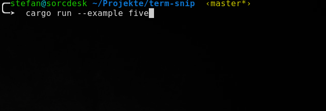

# term-snip

## Description

A small utility crate using https://github.com/mitsuhiko/console to write 
to stdout but limited to a given number if lines. The oldest line is removed 
when writing a new line.

## Usage

From *examples/five.rs*:

```rust
use term_snip::TermSnip;

use std::{thread, time};

/// A simple example writing 15 lines to stdout but only showing
/// a maximum of five lines. 
fn main() {
    let half_sec = time::Duration::from_millis(500);
    
    let mut term = TermSnip::new(5);
    for n in 1..15 {
        term.write_line(&format!("{} - line number {}", n, n)).unwrap();
        
        // just to slow down for demonstration 
        thread::sleep(half_sec);
    }
}
 
```


## Screenshot

Screenshot showing above example in action



## License

Licensed under either of

 * Apache License, Version 2.0, ([LICENSE-APACHE](LICENSE-APACHE) or http://www.apache.org/licenses/LICENSE-2.0)
 * MIT license ([LICENSE-MIT](LICENSE-MIT) or http://opensource.org/licenses/MIT)

at your option.

